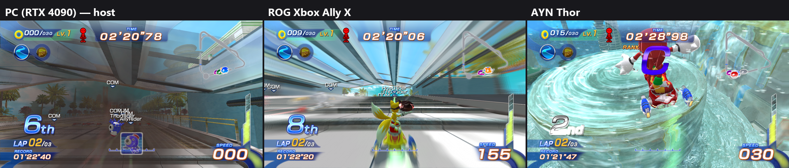

# Free Riders Recompiled

[English](README.md)

Free Riders Recompiled 是以靜態重編譯製作的 Xbox 360 版《Sonic Free Riders》非官方移植，
支援 Windows、Linux 與 Android。可使用手把或鍵盤遊玩，也能在 **Windows 上使用 Kinect／
Kinect v2 或一般攝影機進行體感操作**，並匯入自己的 **VRM 模型**作為遊戲內的 AVATAR 角色。
Kinect v2 目前屬實驗性支援，仍待實機驗證。

遊戲的 PowerPC 程式碼經
[XenonRecomp](https://github.com/hedge-dev/XenonRecomp) 轉成 C++，Xenos 著色器經
[XenosRecomp](https://github.com/sonicnext-dev/XenosRecomp) 轉換，再由原生執行期代替主機的
核心、繪圖、音效、輸入與 Kinect。

**本專案不包含任何遊戲素材。遊玩需要你自己合法取得的遊戲（美版／歐版光碟）：**啟動器會從
你的光碟映像檔安裝遊戲資料。預先建置的版本在
[Releases](https://github.com/YuutaTsubasa/Free-Riders-Recompiled/releases) 頁面；想自己建置，
見[建置說明](docs/building.md)（英文）。

> [!IMPORTANT]
> 仍在開發中。遊戲可以啟動、選單可以操作、比賽可以遊玩，但許多部分尚未測試，可能會停止或
> 出現異常。


## 目前狀態

已經可以：

- 從標題畫面經選單進入比賽：Free Race 從開始到結算；Grand Prix 從劇情進入第一場比賽。
- Direct3D 12 與 Vulkan 繪圖，著色器在遊戲遇到時即時轉換；音效；紀錄的儲存與讀取。
- 不需要 Kinect：Kinect 由程式模擬。按鍵代替選單能聽懂的語音指令，手把驅動比賽讀取的
  身體動作（傾斜、跳躍、踢地加速、抓取、特技）。
- Windows 支援實體 Kinect 與 Kinect v2，將感測器追蹤的骨架交給遊戲。
  Xbox 360 版 Kinect 已實際跑完比賽；Kinect v2 仍屬實驗性支援。
  詳見下方的 [Kinect 與 Kinect v2](#kinect-與-kinect-v2)。
- 各平台都有啟動器：從光碟映像檔安裝遊戲並保存設定，支援英文與繁體中文（右上角可切換）。
- Linux（Vulkan、SDL2），以及 Android（arm64-v8a）的觸控按鈕與傾斜轉彎。
- Windows 可選擇使用 webcam 控制 1P：估算 3D 骨架、手把自動接手，以及獨立骨架 Debug 視窗。
- 實驗性 VRM Avatar 模型：可在啟動器選擇自己的模型，搭配遊戲動畫與手持道具。
- HedgeModManager 格式的檔案替換模組，在啟動器的「模組」分頁管理（[Mods](docs/mods.md)）。

已知限制：

- 只支援美版／歐版光碟。
- 遊戲大部分內容尚未完整遊玩過；上述以外的關卡與模式可能停在執行期還沒做到的地方。
- Linux 與 Android 使用事先在 Windows 上轉換好的著色器（`shaders.pack`，發布版已附）。遊戲會
  在開機時建立著色器；發布版已附上相容的著色器包。
- Android 已在模擬器與一台 Adreno 750 掌機上試過。

開發紀錄在 [docs/](docs/)，從 [docs/progress.md](docs/progress.md) 開始。

## 系統需求

- **Windows**：Windows 10 或 11（x64），支援 AVX 的 CPU，支援 Direct3D 12（或 Vulkan 1.2）的
  顯示卡。
- **Linux**：支援 AVX 的 x86-64 與 Vulkan 1.2 驅動程式（在 Ubuntu 22.04 上測試）。
- **Android**：Android 9 以上、arm64-v8a、Vulkan 1.1；安裝需約 2 GB 可用空間。
- 建置所需工具見 [docs/building.md](docs/building.md)。

## 安裝

1. 從 [Releases](https://github.com/YuutaTsubasa/Free-Riders-Recompiled/releases) 下載對應系統
   的版本：Windows 的 zip、Linux 的 tar.gz，或 Android 的 APK。
2. 解壓縮到一個獨立的資料夾（Android 則安裝 APK）。
3. 執行 `FreeRidersRecompiled`，在啟動器要求時選擇你的光碟映像檔（`.iso`），它會把遊戲資料
   複製到旁邊。然後按 **開始遊戲**。

## 設定分類

啟動器依照用途分成八類：

| 分類 | 設定內容 |
| --- | --- |
| 一般 | 啟動器語言、遊戲語言、語音語言、影片、還原設定 |
| 畫面與效能 | 視窗與遊戲渲染解析度、全螢幕、繪圖後端、垂直同步、可展開的進階效能選項 |
| 音效 | 遊戲音量、啟動器提示音 |
| 控制器與按鍵 | 各玩家的輸入來源與手把、按鍵綁定、Android 觸控與傾斜操作 |
| 體感與攝影機 | Kinect／攝影機模式、裝置與預覽、鏡像、骨架 Debug、語音指令 |
| Avatar 模型 | 選擇或清除自訂 VRM／GLB 模型 |
| 模組 | 啟用或停用檔案替換模組，並調整順序（[Mods](docs/mods.md)） |
| 遊戲檔案 | 安裝、資料位置與 Shader Pack |

兩種解析度一起放在 **畫面與效能 → 解析度**：視窗解析度決定輸出視窗大小，
遊戲渲染解析度決定遊戲實際繪製的像素數。遊戲設定於下次啟動遊戲時套用。

## 建置

Windows 的簡短步驟：

```powershell
python scripts/bootstrap.py
./scripts/build_tools.ps1
python scripts/rom_tool.py extract --iso "你的光碟.iso" --output private/game --path default.xex
python scripts/prepare_recomp.py
./scripts/build_shader_translator.ps1
./scripts/build_tools.ps1 -Diagnostic
./out/build/host/FreeRidersRecompiled.exe
```

第一次執行時，啟動器會要求選擇光碟映像檔，並把遊戲安裝在它旁邊。Linux 與 Android 的建置，
以及每一步的作用，見 [docs/building.md](docs/building.md)；平台細節見
[docs/linux.md](docs/linux.md)、[docs/android.md](docs/android.md)。

## 操作

| 動作 | 鍵盤 | 手把 |
| --- | --- | --- |
| 選單：移動／轉動選單圓環 | 方向鍵 | 十字鍵 |
| 確定（說「OK」） | Z 或空白鍵 | A／✕ |
| 返回 | Esc、X 或 Backspace | B／○ |
| BACK | Tab | BACK／Share |
| 開始、暫停 | Enter | START |
| 比賽：傾斜轉彎 | 方向鍵 | 左類比 |
| 蹲下（按住）、跳躍（放開） | Z 或空白鍵 | A |
| 踢地加速 | C | X |
| 煞車、抓取 | X | B |
| 切換站姿 | V | Y |
| 使用／搖晃道具 | F | RT |
| 招式 | Q／E | LB／RB |
| 手部游標（只認 Kinect 的選單） | I J K L | 右類比 |

Xbox 與 PlayStation 手把都能使用。Android 沒有連接手把時，畫面上的半透明觸控按鈕提供相同的
操作，比賽中也能左右傾斜手機轉彎。

## Kinect 與 Kinect v2

Windows 版支援實體 **Kinect v1** 與 **Kinect v2** 感測器的身體追蹤。
Kinect 為選用功能；使用手把或鍵盤遊玩，不需要感測器，也不必安裝 Kinect SDK。

| 感測器 | 所需設備與軟體 | 目前狀態 |
| --- | --- | --- |
| Xbox 360 版 Kinect／Kinect for Windows 第一代 | SDK 1.8 與供電 USB 連接；Xbox 360 版需完整 SDK，Kinect for Windows 第一代可用 Runtime 1.8 | 已在 Windows 10 上用 Xbox 360 版 Kinect 實際跑完比賽 |
| Kinect v2／Xbox One 版 Kinect | SDK 2.0、USB 3.0 與相容的 PC 電源轉接器 | 實驗性支援；已實作骨架追蹤，仍待實機遊玩驗證 |

安裝對應 SDK 並連接感測器後，在啟動器的 **體感與攝影機 → 攝影機** 設定選擇 **Kinect**，
再按 **開啟預覽** 確認追蹤狀態。兩代共用同一個選項：程式先嘗試 v1，再嘗試 v2。
請讓全身進入感測器範圍，並預留足夠的活動空間。

Kinect v1 可提供骨架、深度與彩色影像；目前的 v2 支援只提供骨架，並以骨架補足
轉向與蹲跳判定。實體 Kinect 輸入僅支援 Windows，Linux 與 Android 發行包尚未提供。

SDK 下載、轉接器需求與疑難排解見 [Kinect 感測器使用說明](docs/kinect-sensor.md)。
若要使用一般攝影機進行體感操作，請看下一節。

## 攝影機體感


*從同一幀錄影裁切並排的遊戲與骨架畫面。Debug 視窗以正面與側面視角顯示實際交給遊戲的
關節，不顯示攝影機影像。*

Windows 發行包已內附體感模型與執行庫。在啟動器選擇 **體感與攝影機 → 攝影機 → 體感**，
並讓全身進入鏡頭範圍。可另外開啟 **骨架 Debug 視窗**，查看遊戲收到的骨架正面與
側面視圖；視窗不顯示攝影機影像。

攝影機控制 1P，操作手把時由手把優先接手；手把閒置 1.5 秒且仍有有效追蹤時，才回到
體感。失去追蹤時仍可用手把操作。單人遊玩可將 2P 輸入設為 **關閉**。

姿勢推論在本機執行，使用 [ONNX Runtime](https://github.com/microsoft/onnxruntime)
1.30.0（MIT），搭配 [OpenCV Zoo 的 MediaPipe 姿勢模型](https://github.com/opencv/opencv_zoo/tree/47534e27c9851bb1128ccc0102f1145e27f23f98/models/pose_estimation_mediapipe)
與[人物偵測模型](https://github.com/opencv/opencv_zoo/tree/47534e27c9851bb1128ccc0102f1145e27f23f98/models/person_detection_mediapipe)
（Apache 2.0）。模型源自 Google MediaPipe，本專案使用其 ONNX 轉換版本，
不需要安裝 MediaPipe 或 OpenCV 執行庫。下載檔的 SHA-256 固定於
[scripts/fetch_pose_model.py](scripts/fetch_pose_model.py)，Windows 發行包的 `licenses/`
資料夾內附授權與第三方通知。

單眼攝影機估算的是相對 3D 姿勢，並非 Kinect 的深度量測。Linux 與 Android 預建包
目前未啟用 Camera 體感。設定、動作說明與自行建置方式見[攝影機體感輸入](docs/camera-input.md)。

## VRM Avatar 模型

從 v0.3.0 起，可用自己的 **VRM 0.x／VRM 1.0** 模型替換遊戲內的 **AVATAR** 角色。
不需要開啟攝影機體感，手把與鍵盤也可以操作。


*以自訂 VRM 模型替換遊戲內的 AVATAR 角色。*

1. 開啟啟動器的 **Avatar 模型** 分頁。
2. 按 **瀏覽**，選擇 `.vrm` 或二進位 `.glb` 檔。桌面版也可直接輸入路徑；Android 會將
   模型複製到 app 的儲存空間。
3. 啟動遊戲，在角色選單選擇 **AVATAR**，再選 Gear。存檔需已能選擇 AVATAR；設定模型
   不會自動解鎖角色。
4. 更換模型後需重新啟動遊戲；按 **清除** 可停用自訂模型。

1P／2P 共用一個模型設定，由遊戲內誰選擇 AVATAR 決定套用對象，各自保留動作姿勢。
其他角色不受影響。模型會出現在 Loading 與比賽中，跟隨遊戲的主要身體動畫、跳躍與
換邊動作，手持道具也會使用 VRM 的手部位置。模型只在本機讀取，發布包不附模型，
也不會上傳你的模型。

目前仍屬實驗性功能。沒有 VRM 人形骨架的 `.glb` 會保持靜態；尚未實作完整 MToon、
透明混合、彈簧骨骼、表情與手指動畫。不同模型的姿勢與道具握持位置可能有差異，
高精細模型也可能降低效能。已檢查 Windows D3D12／Vulkan 遊玩；完整雙人 VRM 與
Linux／Android 實機 VRM 遊玩仍待更多測試。

平台細節與疑難排解見 [VRM Avatar 使用說明](docs/vrm-avatar.md)（英文）。

## 線上對戰

從 v0.7.0 開始，遊戲的 **Xbox LIVE** 模式可以再次使用了：改由本專案提供的伺服器取代微軟的
伺服器，支援 Create Match、Quick Match、大廳與線上比賽。Windows、Linux 與 Android 的玩家
可以一起比賽。



*同一場線上比賽：PC（主機）、ROG Xbox Ally X 與 AYN Thor。*

1. 每台裝置：**啟動器 → 一般 → 線上遊玩 → Xbox LIVE**。
2. **一台裝置當主機**：開啟 **由這台裝置當伺服器**。遊戲本身會在 TCP 與 UDP 連接埠 47800 執行
   伺服器。Windows 第一次會詢問是否讓遊戲通過防火牆，請在私人網路上允許；Android 不需要設定。
3. **其他裝置連線**：在 **伺服器位址** 輸入主機的區域網路 IP（例如 `192.168.1.10`），每位玩家
   的 **線上名稱** 要不同。存檔與設定檔不受影響。
4. 進入遊戲後開啟 **主選單 → Xbox LIVE**。主機選 **Create Match**；其他人選 **Quick Match**，
   在找到的大廳上按 **A**。由主機開始比賽。

已在家用網路測試：三台裝置同一場比賽、主機是 PC 或 AYN Thor、有玩家中途離開。透過網際網路
對戰需要把 47800 連接埠轉送到主機，這部分還沒測試。排行榜、Xbox LIVE Party、語音聊天與
成就不支援。

詳細說明與運作方式：[Online play](docs/xbox-live.md)（英文）。

## 常見問題

**如何選擇西班牙文或其他遊戲語言？** 在啟動器的 **一般 → 遊戲語言** 選擇英文、日文、
德文、法文、西班牙文或義大利文，再啟動遊戲。預設的 **系統語言** 會依照作業系統設定；
這與啟動器的英文／繁體中文介面分開。不支援的系統語言會使用英文，無法取得或對應的
系統國家會使用美國設定，並在 `game.log` 留下警告，不需修改作業系統設定。
直接執行遊戲時可設定 `SFR_GAME_LANGUAGE=auto/en/ja/de/fr/es/it`（擇一），無效值視同 `auto`。

**設定與存檔在哪裡？** 在啟動器旁：`settings.ini`、`save/` 與 `game.log`（Android 在 app 的
檔案目錄）。遊戲以名為「Player」的本機帳號遊玩；問到「Are you Player?」時選 Yes，第一次會問
是否建立存檔。

**為什麼 Linux 與 Android 需要 `shaders.pack`？** Xbox 著色器是在遊戲執行時用 Windows 的工具
轉換的。包裡帶著轉換好的著色器，給沒有這些工具的機器使用；遊戲在開機時就建立所有著色器，所以
在 Windows 上（也用 Vulkan 跑一次，以產生 SPIR-V）啟動遊戲一次後，用
`python scripts/pack_shaders.py` 做出的包就是完整的。發布版已附上。

**能用模組嗎？** 從 v0.6.0 起支援檔案替換模組：把每個模組各自放在啟動器旁 `mods` 裡的一個資料夾，
再到「模組」分頁啟用（[Mods](docs/mods.md)）。為原版遊戲做的聲音、貼圖與文字模組，只要把檔案
放進附有 `mod.ini` 的資料夾就能用，例如[繁體中文化 MOD](https://github.com/YuutaTsubasa/Free-Riders-Recompiled-Traditional-Chinese-Mod)。
程式碼類的模組不適用：No Kinect Patch 修改的是給 Xenia 用的原版執行檔，而這裡的 Kinect 模擬是
本專案自己的程式碼。

**為什麼發布版還需要我的光碟？** 發布版只有重編譯後的程式，不含任何遊戲資料（模型、貼圖、
聲音、影片）：這些來自你自己的光碟映像檔。`.github/workflows` 的工作流程只建置與測試不含
遊戲內容的部分；發布版在維護者的電腦上以光碟建置（[docs/releasing.md](docs/releasing.md)）。

## 致謝

- [XenonRecomp](https://github.com/hedge-dev/XenonRecomp)、[XenosRecomp](https://github.com/sonicnext-dev/XenosRecomp)：
  PowerPC 與著色器重編譯器。
- [Unleashed Recompiled](https://github.com/hedge-dev/UnleashedRecomp)、
  [Marathon Recompiled](https://github.com/sonicnext-dev/MarathonRecomp)：本專案參考學習的移植
  （執行期架構、繪圖、啟動器的形式）。沒有使用它們的美術素材；啟動器的圖像與音效都由程式
  自行繪製與合成。
- [Plume](https://github.com/renderbag/plume)（繪圖）、[SDL](https://www.libsdl.org)（Linux 與
  Android）、[Dear ImGui](https://github.com/ocornut/imgui)（啟動器）、
  [DirectX Shader Compiler](https://github.com/microsoft/DirectXShaderCompiler)（經
  [dxc-bin](https://github.com/renderbag/dxc-bin)）。
- [Xenia](https://github.com/xenia-project/xenia)：Xbox 360 核心行為的參考。
- [Xenia Canary 的連線版](https://github.com/AdrianCassar/xenia-canary)（`netplay_canary_experimental`，
  BSD 授權）：線上對戰所回應的 Xbox LIVE 結構與訊息編號的參考。沒有使用它的程式碼。
- [ONNX Runtime](https://github.com/microsoft/onnxruntime)（姿勢推論）、
  [OpenCV Zoo](https://github.com/opencv/opencv_zoo) 與
  [MediaPipe](https://github.com/google-ai-edge/mediapipe)（人物偵測與 3D 姿勢模型）。
  確切版本與授權見 [THIRD_PARTY.md](THIRD_PARTY.md)。
- [No Kinect Patch](https://gamebanana.com/mods/456720)，作者 Rei-SanTH（測試：SmileyWorld、
  MagicShad、ivaschia）：它的逆向筆記指出遊戲在哪裡讀取 Kinect 的語音指令與手部游標，
  為本專案的 Kinect 模擬提供了方向。該補丁以 CC BY-NC-ND 4.0 授權；本專案沒有使用或
  包含它的任何程式碼或檔案。

本專案在 AI 模型 GPT-6 與 Claude Opus 5 的協助下開發。

授權與確切版本見 [THIRD_PARTY.md](THIRD_PARTY.md) 與
[config/dependencies.lock.json](config/dependencies.lock.json)。

《Sonic Free Riders》© SEGA。本專案與 SEGA 及 Microsoft 無關，也未受其認可。

## 授權

本專案程式碼以 GNU General Public License v3.0 或更新版本授權（[COPYING](COPYING)）。遊戲本身
的程式與資料仍屬 SEGA，不在此授權範圍內。
